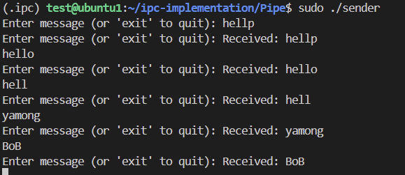

# Pipe
> [!NOTE]
> 파이프는 주로 부모-자식 프로세스 간 통신에 사용되므로, 여기서는 C 프로그램이 부모 프로세스가 되어 Python 스크립트를 자식 프로세스로 실행하도록 구성하였음

## 사용방법
```bash
gcc ipc_sender.c -o sender
sudo ./sender

# 다른 터미널
sudo python3 ipc_receiver.py
```

## 결과
